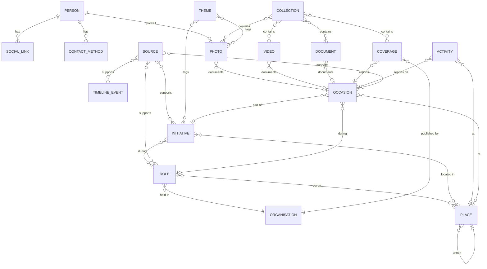

# C. Content Architecture

**Status:** Accepted ([0004](../decisions/0004-content-and-verification-model.md), amended by [0020](../decisions/0020-occasion-connective-archive-entity.md)); entity model is working direction. This is a conceptual model, not a field-by-field schema, and not
permission to implement every field immediately. All person-specific values remain empty.

## 1. Design goals

1. **One fact, one place.** A fact is recorded once and reused (e.g. the Timeline is generated, not re-typed).
2. **Provenance travels with content.** Verification status and sources are part of every claim-bearing item.
3. **Missing data is normal.** Every person-specific field is optional at the schema level; publish rules decide what is required to appear.
4. **Language-aware by design.** Each field is either language-neutral or localised in both languages.
5. **Add content without code.** New items of an existing type require no code changes.
6. **Stage the build.** Implement only the entities and fields needed for real content as it arrives.

## 2. Common fields (all entities)

| Field | Purpose |
|---|---|
| `id` | Stable identifier; also the basis for the URL slug (Latin script, same in both languages). |
| `status` | `draft` → `review` → `published` → `archived`. Only `published` reaches production. |
| `verification` | For claim-bearing entities: `verified`, `supplied`, `media-reported`, `unverified` (see §3). |
| `sources` | References to Source entries. |
| `originalLanguage` | `en` or `hi`: the language the content was authored in. |
| `translation` | Per language: state (`missing`, `machine-draft`, `in-review`, `reviewed`), reviewer, review date, and a fingerprint of the original text at review time. |
| `themes` | References to Theme entries. |
| `internalNotes` | Never rendered or shipped. |
| `devFixture` | `true` only for synthetic development data; blocks production builds. |
| `createdAt` / `updatedAt` | Maintenance metadata. |

### Dates

Archival dates are often imprecise. Every date is modelled as:

- `value`: e.g. `1998`, `1998-03`, `1998-03-14`
- `precision`: `year` | `month` | `day`
- `approximate`: true for "circa"
- optional `end` for ranges (same structure)

Displays never show more precision than is recorded.

## 3. Verification model

| Status | Meaning | Publish requirement | Public presentation |
|---|---|---|---|
| `verified` | Confirmed by reliable documentation or an appropriate independent source | ≥ 1 Source | Concise label (e.g. "Source: Municipal record") with optional fuller source details ([0004](../decisions/0004-content-and-verification-model.md)) |
| `supplied` | Provided by the person or family, not independently documented | Internal record of who supplied it and when | Attributed (e.g. "as provided by the family"), exact wording to be decided |
| `media-reported` | Reported by media coverage | Link to a Coverage item or Source | Attributed to the outlet |
| `unverified` | Not yet confirmed | **Cannot be published.** Build fails. | Never shown |

**Granularity.** Verification applies per item. Long-form text (e.g. the long biography) is
treated as `supplied` overall. Any statement inside long-form text that is not supportable is
removed before publishing; this is an editorial review step, since it cannot be automated.

**Sources and notes (presentation of provenance).** No academic-style footnote clutter
([0004](../decisions/0004-content-and-verification-model.md); presentation fixed by
[0026](../decisions/0026-verification-and-source-presentation.md)). Traceability is unchanged.

- **Specific factual claims** inside long-form text (dates, positions, figures) carry a **concise
  source/reference marker** where useful. The marker links to its entry in the page's notes section.
  Running text has no discursive footnotes.
- **Longer pages and content** (biography, initiative bodies, collection introductions) end with a
  **"Sources and notes"** section listing those sources.
- **Items and role rows** show the concise provenance label, with **optional fuller source details**
  on demand, as above.
- The rules are unchanged: `verified` requires a source, `unverified` is never published, and
  internal sources are never rendered ([0018](../decisions/0018-content-integrity-rules.md)).

**Raising a status.** An item moves from `supplied` to `verified` when a source is added. History
is kept in git.

## 4. Entity catalogue

| Entity | Purpose | Key attributes (conceptual) | Relationships |
|---|---|---|---|
| **Person** (single) | The subject of the site | Legal name; preferred public name; names in Devanagari and Latin; known spelling variants; portrait; short bio and long bio (both languages); optional life dates (publication policy open) | → Photo (portrait); → SocialLink; → ContactMethod |
| **Role** | A position held | Title; how obtained (elected / appointed / nominated / other); period; ward or area; verification | → Organisation; → Place; → Source; ← Initiative; ← TimelineEvent; ← Occasion |
| **Organisation** | A body the person was part of or worked with | Name (both languages); type (municipal body, political party, committee, NGO, institution, other) | ← Role; ← Initiative; ← Coverage (outlet) |
| **Place** | A geographic reference | Name (both languages); type (ward, locality, landmark, city, district); parent place; optional coordinates | Self-referencing hierarchy; ← most entities |
| **Initiative** | Public-service or community work | Title; summary; body; period; status; outcomes (**publishable only with sources**) | → Role; → Place; → Theme; → Photo / Video / Document; → Coverage; → Source; ← Occasion |
| **Activity** | A current or recent activity | Type (event, visit, announcement, appearance, community activity); date or range; place; body; media | → Place; → Theme; → Photo / Video; → Occasion (optional) |
| **Occasion** | A real-world event or episode that connects multiple records ([0020](../decisions/0020-occasion-connective-archive-entity.md)) | Title; date with precision or short range; place(s); optional summary; verification; `onTimeline` flag | → Place; → Theme; → Source; → Role (optional); → Initiative (optional); ← Photo / Video / Document / Coverage; ← Activity |
| **TimelineEvent** | A milestone with **no** Occasion (no connected material) and not represented by another entity | Date; title; summary; category | → Place; → Source; → any item |
| **Coverage** | A media item about or involving the person | Outlet; date; headline in original language and script; language; format (print, online, TV, radio, interview); URL; web-archive URL; excerpt; rights | → Organisation (outlet); → Document / Photo (scan); → Theme; → Occasion (optional); ← used as Source |
| **Source** | Evidence supporting claims | Type (official record, gazette/notification, news report, interview, family testimony, personal document, other); title; publisher; date; URL; archive URL; file reference; visibility (`public` / `internal`) | ← any claim-bearing entity |
| **Photo** | A photograph | Image; caption and alt text (both languages); date; place; people depicted (public figures only, by name); photographer/credit; rights; consent flags; press-approved flag | → Place; → Theme; → Collection; → Source; → Occasion (optional) |
| **Video** | A video or recorded interview | Provider and ID, or file; duration; captions; transcript; credit; rights | → Place; → Theme; → Collection; → Coverage; → Occasion (optional) |
| **Document** | A scanned or digital document | File; type (certificate, letter, notice, report, clipping, other); extracted text; redaction status; rights | → Place; → Theme; → Collection; → Source; → Occasion (optional) |
| **Collection** | A curated set or narrative story | Title; introduction; ordered items; cover image | → Photo / Video / Document / Coverage |
| **Theme** | Controlled topic vocabulary | Label (both languages); description | ← most entities |
| **SocialLink** | Official social profile | Platform; URL; handle; public flag; order | ← Person |
| **ContactMethod** | Approved contact channel | Type (email, phone, WhatsApp, postal, form); value; purpose (general, press, corrections); public flag; order | ← Person |
| **GlossaryTerm** | Standard rendering of recurring terms | English form; Hindi form; transliteration; usage notes | Used by translators and reviewers ([09](09-language-glossary.md)) |

Each archive item (Photo, Video, Document, Coverage) and each Activity references **at most one**
Occasion. Every such reference is optional.

### 4.1 Occasion, TimelineEvent, Activity, Initiative and archive items

These concepts are distinct and must not be used interchangeably
([0020](../decisions/0020-occasion-connective-archive-entity.md)):

| Concept | What it is | Example of use (abstract) | Not to be used for |
|---|---|---|---|
| **Occasion** | The **happening**: a dated, placed real-world event or episode that connects material | ‹an inauguration› with photos, a press report and a video | Curated stories (use Collection); ongoing programmes (use Initiative); update posts (use Activity) |
| **TimelineEvent** | A **milestone with no connected material** | ‹a milestone known only from a source› | Anything that has an Occasion. Flag the Occasion `onTimeline` instead |
| **Activity** (Update) | The **publication**: a dated post in Updates | An update announcing or reporting ‹an occasion› | Recording the facts of an occasion. Reference the Occasion instead, if one exists |
| **Initiative** | A **sustained programme** of public-service or community work over a period | ‹a programme› that included several occasions | Single events |
| **Archive item** (Photo, Video, Document, Coverage) | The **evidence or record**: one piece of material, with its own caption, credit, rights and verification | A photograph of ‹the occasion› | Restating the occasion's facts. Link to the Occasion |
| **Collection** | An **authored, curated story** or set | ‹a curated story› across several occasions | Factual grouping of one occasion's material |

**Rules of thumb:**
- Facts about *what happened, when and where* live on the Occasion.
- An archive item adds only what is specific to that item.
- Create an Occasion only when at least two items document the same happening, or an update's
  material is expected to enter the archive.
- A milestone gets either an `onTimeline` Occasion or a TimelineEvent, never both.

## 5. Relationships

(Simplified. Photo, Video, Document and Coverage also relate to Place, Theme and Source.)

## 6. Derived views

These are generated from the entities, never edited by hand:

| View | Built from |
|---|---|
| **Timeline** | Every publishable dated item: Role start/end, Initiative period, Activity, Coverage, Occasions flagged `onTimeline`, and TimelineEvents. TimelineEvent is used only for milestones with no Occasion and not represented elsewhere. Material linked to an `onTimeline` Occasion appears through that Occasion entry, not as separate duplicate entries. |
| **Public Life overview** | Roles, Organisations, Initiatives |
| **Archive browse** | Photo, Document, Coverage, Video, browsed one lens at a time by type, time (period derived from Roles, or decade), theme and place ([0022](../decisions/0022-archive-browsing-model.md)) |
| **Related items** | **First:** "From the same occasion" (other published items referencing the same Occasion). **Then:** shared Place, Theme, Collection, Role or overlapping date range |
| **Press Kit** | Person bios + press-approved Photos + press ContactMethod |
| **Structured data (SEO)** | Person, published Roles (non-`unverified`), Photos, upcoming Events |

## 7. Language-neutral vs localised fields

| Language-neutral (one value) | Localised (English + Hindi) |
|---|---|
| IDs, slugs, dates, URLs, files, coordinates, references, status fields, rights, consent flags | Names where they differ by script, titles, captions, alt text, summaries, bodies, labels, excerpts (translated), SEO title/description |

Original-language artefacts (e.g. a Hindi newspaper headline) are stored in their original script
as language-neutral data, with a translation as a separate localised field.

## 8. Data classification

| Class | Examples | Where it lives |
|---|---|---|
| **Public** | Published content and approved assets | Repository; rendered |
| **Internal** | Internal notes, internal-only sources, supplier records, consent records (as references) | Repository; **never rendered or shipped** |
| **Restricted** | Original scans with personal data, private contact details, identity documents, signed consent forms, family-private material | **Never in git.** Family-controlled storage (location to be decided) |

See [G](07-security-privacy-integrity.md) for handling rules.

## 9. Assets

- **Masters** (original scans and photos at full quality) are preserved outside the website (see G and F §5).
- **Derivatives** (web-sized, metadata-stripped, redacted where needed) are what the website uses.
- The content entry records credit, rights and provenance. These are never relied on from embedded file metadata, which is stripped.

## 10. Development fixtures

- Stored separately from real content and flagged `devFixture: true`.
- Visibly synthetic: e.g. `[DEV] Sample role title`, neutral grey images, no realistic names, parties, wards or claims.
- A production build fails if any fixture is present.
- Fixtures exist only to exercise layouts and edge cases (long Hindi titles, missing optional fields, imprecise dates).

## 11. Proposed implementation staging

| Stage | Entities |
|---|---|
| **MVP** | Person, Role, Organisation, Place, Source, Photo, Coverage, Activity, Theme, SocialLink, ContactMethod, GlossaryTerm |
| **When content warrants** | Initiative, Document, Video, Collection, TimelineEvent, **Occasion** (once at least two published items document the same happening) |

Fields within each entity are likewise added when real content needs them.
